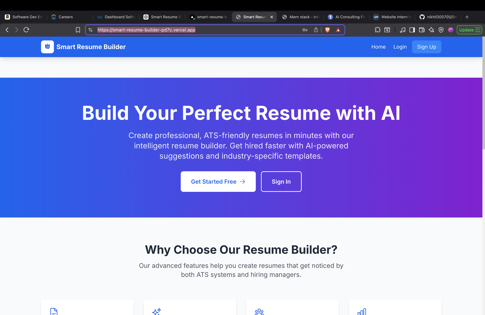
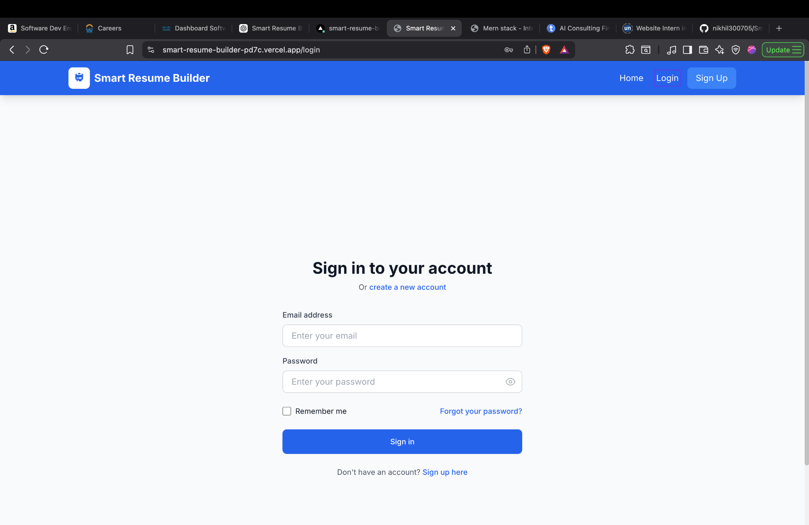
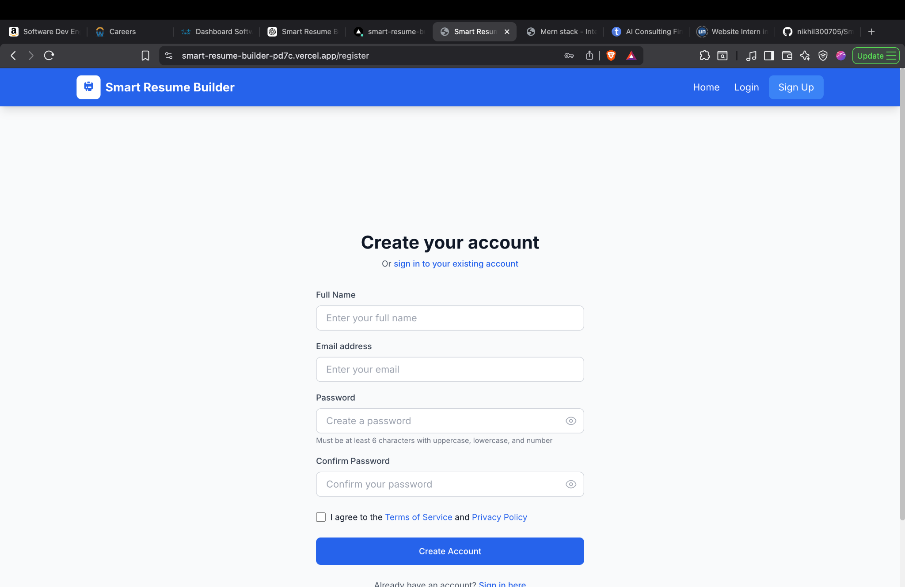
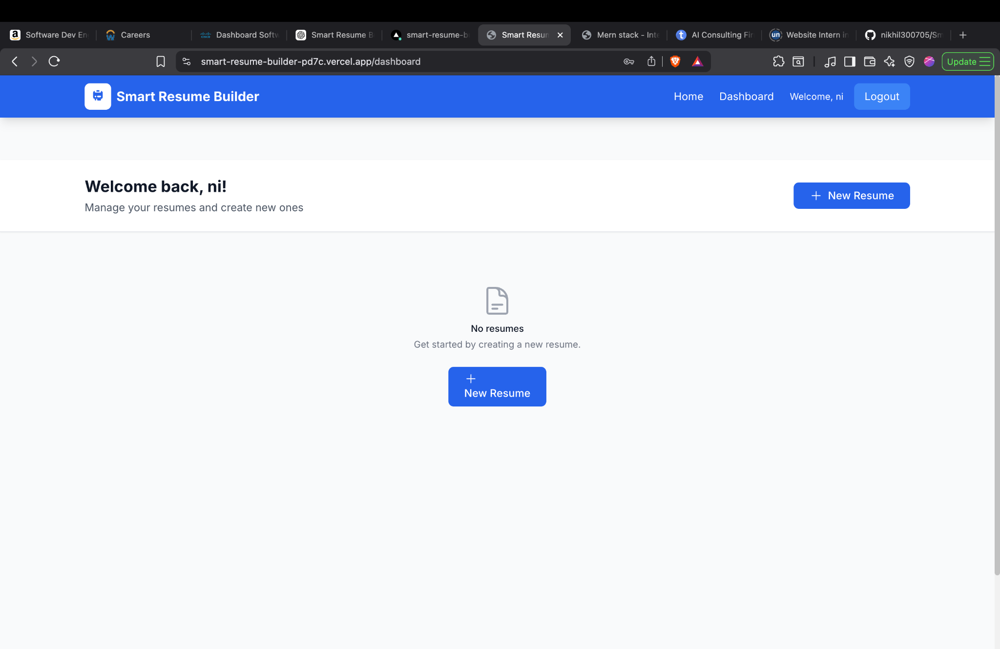

# 🚀 Smart Resume Builder with AI Suggestions

<p align="center">
  <b>Production-ready MERN application for building ATS-optimized resumes with intelligent AI-driven suggestions</b>
</p>

<p align="center">
  🌐 <a href="https://smart-resume-builder-pd7c.vercel.app">Live Demo</a> • 
  💻 <a href="https://github.com/nikhil300705/Smart-Resume-Builder">Repository</a> • 
  💼 <a href="https://www.linkedin.com/in/appari-nikhil-eswar-791229339/">LinkedIn</a>
</p>

---

## 🧭 Overview

Smart Resume Builder is a full-stack web application designed to help users create professional, ATS-friendly resumes using intelligent AI suggestions.

It demonstrates real-world full-stack development, deployment, and debugging production issues.

---

## 📸 Application Screenshots

### 🏠 Landing Page

<p align="center">
  
</p>

### 🔐 Login Page

<p align="center">
  
</p>

### 📝 Register Page

<p align="center">
  
</p>

### 📊 Dashboard

<p align="center">
  
</p>

---

## 🏗️ Architecture

Frontend (React + Tailwind)
↓
REST API (Express.js)
↓
MongoDB

---

## ✨ Features

* 🤖 AI-powered resume suggestions
* 📄 Dynamic resume builder
* 🎯 ATS optimization
* 🔐 JWT-based authentication
* ⚡ Responsive UI
* 🧩 Modular architecture

---

## 🛠️ Tech Stack

* Frontend: React.js, Tailwind CSS
* Backend: Node.js, Express.js
* Database: MongoDB
* Routing: React Router
* Deployment: Vercel

---

## 📂 Project Structure

```bash
Smart-Resume-Builder/
│
├── backend/
├── frontend/
├── Dashboard.png
├── Landingpage.png
├── LoginPage.png
├── RegisterPage.png
├── README.md
└── .gitignore
```

---

## ⚙️ Local Setup

```bash
git clone https://github.com/nikhil300705/Smart-Resume-Builder.git
cd Smart-Resume-Builder
```

### Frontend

```bash
cd frontend
npm install
npm start
```

### Backend

```bash
cd backend
npm install
npm run dev
```

---

## 🔐 Environment Variables

Create `.env` in backend:

```
MONGO_URI=your_mongodb_connection
JWT_SECRET=your_secret_key
PORT=5000
```

---

## 🚀 Deployment

* Frontend deployed on Vercel
* Root Directory → frontend
* Build Command → npm run build
* Output Directory → build

---

## 🧪 Challenges & Fixes

* Fixed Vercel build failure
* Resolved CI pipeline issues
* Removed duplicate project from Git
* Fixed dependency issues

---

## 👨‍💻 Author

**Nikhil Eswar**

* GitHub: https://github.com/nikhil300705
* LinkedIn: https://www.linkedin.com/in/appari-nikhil-eswar-791229339/

---

## ⭐ Support

If you like this project, give it a ⭐ on GitHub!
